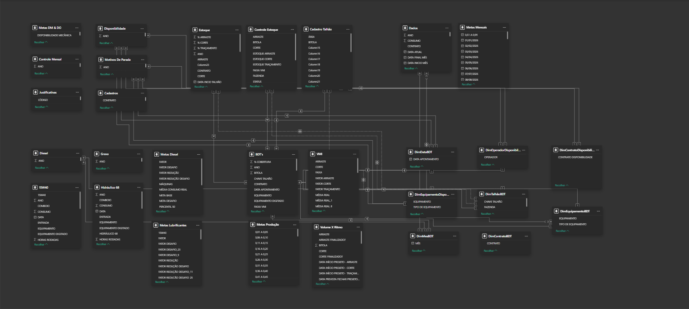

# 📊 Industrial Operations BI Architecture

This repository presents a **complete end-to-end Business Intelligence architecture** designed to simulate a real-world industrial operations environment.

The project consolidates production, maintenance, consumption, and operational availability data into a structured analytical ecosystem built to support:

- Operational monitoring  
- Performance diagnosis  
- Maintenance strategy evaluation  
- Data-driven industrial decision-making  

⚠️ **All data used in this project is fictional and for demonstration purposes only.**  
Some visuals, tables, and terminology are in **Portuguese**, reflecting the original operational context and real-world usage.

---

# 🎯 Project Objective

To design a **scalable, decision-oriented BI architecture** capable of:

- Structuring operational data into analytical domains  
- Transforming raw industrial records into engineered KPIs  
- Measuring mechanical and operational availability  
- Evaluating operator productivity  
- Quantifying maintenance impact on output  
- Supporting structured, hierarchical decision-making  

This project represents:

> **Phase 1 – Foundational Operational Intelligence Layer**

---

# 🧠 Architectural Philosophy

This solution was designed following four core principles:

- **Layered Analytical Design** — From executive snapshot to operational deep dive  
- **Decision-Oriented Structuring** — Each page answers a specific business question  
- **KPI-First Modeling Approach** — Indicators define the model, not the opposite  
- **Business-Domain Segmentation** — Clear separation between production, maintenance, operations, and consumption  

The dashboard is not a collection of charts — it is a structured analytical narrative.

---

# 📁 Repository Structure

- **Dashboard Architecture**
  - Multi-page analytical environment  
  - Structured navigation logic  
  - Dual visualization modes (Graphic & Table in selected pages)  
  - Bookmark-based filter panel system  

- **Data Model**
  - Multi-Fact Star Schema (Constellation Model)  
  - Shared dimensions across operational domains  
  - Optimized for scalable DAX measures  

- **Visual Documentation**
  - Dashboard walkthrough GIFs  
  - Page previews  
  - Data model diagram  

---

# 🏗️ Dashboard Modules & Analytical Narrative

The dashboard was designed to guide the user from macro-level monitoring to detailed operational diagnosis.

---

## 1️⃣ Starting Page — Context & Navigation Layer

**GIF:**  
`gifs/01_starting_page.gif`

The Starting Page acts as the **entry point of the analytical journey**.

It simulates a corporate BI environment and provides:

- Fictional company presentation  
- Structured navigation buttons  
- Organized access to analytical modules  

Its role is structural — establishing hierarchy and guiding user flow across the analytical environment.

---

## 2️⃣ Executive Overview — Operational Health Snapshot

**GIF:**  
`gifs/02_overview.gif`

The Executive Overview consolidates the most critical operational KPIs into a high-level view.

This page answers:

- Are we operating within availability targets?  
- Is production aligned with expectations?  
- Are consumption levels under control?  

Key indicators include:

- Mechanical Availability (DM)  
- Operational Availability (DO)  
- Total worked vs operated hours  
- Downtime volume overview  
- Consumption indicators  

This page functions as a **decision-trigger layer**, highlighting where deeper analysis is required.

---

## 3️⃣ Operators Performance — Individual Accountability Layer

**GIF:**  
`gifs/03_operators.gif`

This module shifts the analytical focus to the human factor.

It evaluates:

- Production per operator  
- Ranking performance  
- Operated vs worked hours  
- Target comparison  

Some analytical pages include:

- Graphic View  
- Table View toggle (via lateral navigation buttons)  

This module supports workforce optimization and accountability.

---

## 4️⃣ Consumption vs Efficiency — Cost-Performance Correlation

**GIF:**  
`gifs/04_consumption_and_efficiency.gif`

This page correlates production output with material consumption.

It helps answer:

- Are we consuming proportionally to production?  
- Are there inefficiencies or anomalies?  
- Is cost aligned with productivity?  

It transforms raw diesel and lubricant data into structured efficiency indicators.

---

## 5️⃣ Mechanical Availability (DM) — Equipment Reliability Layer

**GIF:**  
`gifs/05_mechanical_availability.gif`

This module focuses on equipment mechanical health.

It includes:

- Mechanical Availability (DM) calculation  
- Downtime classification  
- Breakdown by stop reason  
- Equipment-level reliability analysis  

It supports maintenance strategy evaluation and failure pattern identification.

---

## 6️⃣ Operational Availability (DO) — Real-World Uptime Analysis

**GIF:**  
`gifs/06_operational_availability.gif`

Operational Availability expands the analysis beyond mechanical reliability.

It incorporates:

- Operational delays  
- Non-mechanical interruptions  
- Detailed stop classification  
- Shift-level availability analysis  

This module reflects real production conditions, not only mechanical capability.

---

## 7️⃣ Maintenance vs Production Impact — Strategic Trade-Off Layer

**GIF:**  
`gifs/07_maintenance_vs_production.gif`

This module evaluates the relationship between maintenance activity and production performance.

It allows:

- Comparison of maintenance events vs production output  
- Preventive vs corrective balance analysis  
- Downtime impact evaluation  

This page supports long-term operational strategy decisions.

---

# 🧩 Data Modeling Approach

The project follows a **Multi-Fact Star Schema (Constellation Model)**.

Multiple fact tables share common dimension tables to ensure:

- Clean aggregation logic  
- Scalable KPI development  
- Optimized performance  
- Clear separation of operational domains  

### Core Fact Domains
- Production  
- Maintenance  
- Operations  
- Consumption  
- Targets  

### Shared Dimensions
- Date  
- Operator  
- Equipment  
- Operation Type  
- Contract  
- Operational Area  

---

# 📊 Key Indicators

Main KPIs implemented:

- Mechanical Availability (DM)  
- Operational Availability (DO)  
- Production per Operator  
- Maintenance Impact Indicator  
- Consumption Efficiency Indicators  
- Downtime Classification Index  

For detailed business logic, formulas, and calculation rules, refer to the spreadsheet architecture repository:

👉 https://github.com/gabrihsf/operational-production-spreadsheet

---

# 🛠️ Technical Stack

- Power BI  
- DAX  
- Multi-Fact Star Schema Modeling  
- Bookmark-based Interaction Design  

---

# 🧠 Analytical Competencies Applied

- KPI Engineering  
- Industrial Process Structuring  
- Decision-Oriented Dashboard Design  
- Performance Diagnosis Modeling  
- Operational Data Architecture  

---

# 📈 Project Status

**Current Phase:** Foundational Operational Intelligence Layer Complete  

### Planned Future Iterations

- Full dual-view implementation (Graphic/Table across all pages)  
- Predictive maintenance indicators  
- Scenario simulation layer  
- Executive strategic dashboard module  
- Advanced performance analytics  

---

# 👤 Author

Developed by **Gabriel Henrique**  
Computer Science Student | Business Intelligence & Data Analytics  
Focused on connecting data architecture with real-world operational decision-making
